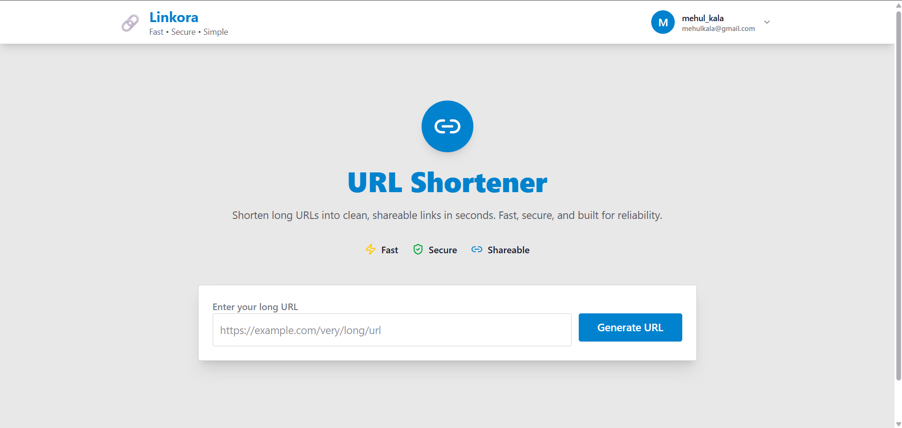
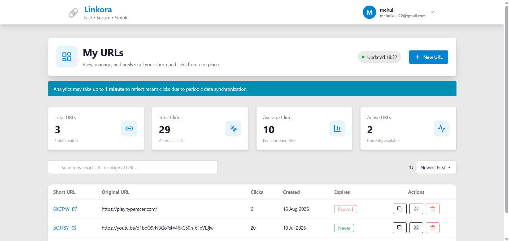
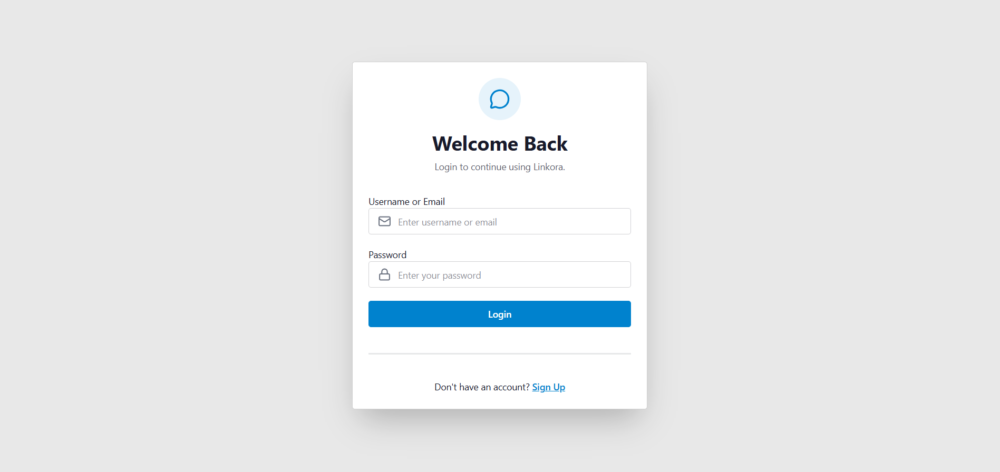
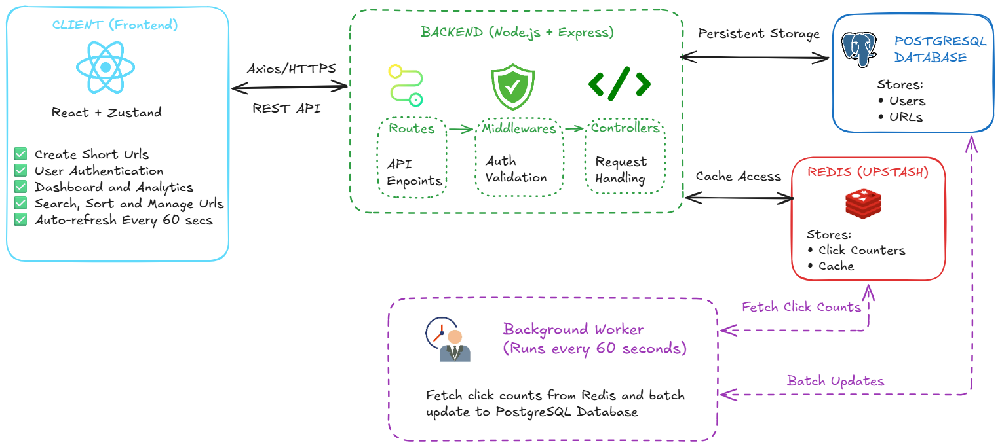

<div align="center">

# 🔗 Linkora

### Fast • Secure URL Shortener with Analytics

A modern full-stack URL shortening platform built using **React, Node.js, PostgreSQL, and Redis**, featuring secure authentication, Redis-backed click tracking, configurable rate limiting, URL expiration, QR code generation, near real-time analytics, and an optimized background synchronization architecture.

[Live Demo](https://linkora-dev.onrender.com/)

</div>

---

# ✨ Features

### 🔐 Authentication

* Secure Signup & Login
* JWT Authentication
* HTTP-only Cookies
* Persistent Login Sessions
* Protected Dashboard

### 🔗 URL Shortening

* Generate unique short URLs
* One-click copy
* Instant redirection
* Delete shortened URLs
* Configurable URL expiration
* Automatic handling of expired URLs

### 📱 QR Code Generation

* Generate QR codes for shortened URLs
* QR codes are generated directly on the frontend
* Uses `qrcode.react`
* Quickly scan and access shortened links
* QR codes can be generated directly from the dashboard

### 📊 Analytics Dashboard

* Total URLs
* Total Clicks
* Average Clicks
* Active URLs
* Search URLs
* Sort by

  * Newest
  * Oldest
  * Most Clicked
  * Least Clicked
* Automatic refresh every minute
* Skeleton loading UI
* Last updated status

### ⚡ Performance

* Redis cache for click tracking
* Background worker synchronizes Redis → PostgreSQL every 60 seconds
* Significantly reduces database writes
* Near real-time analytics

### 🛡️ Rate Limiting

* Configurable per-IP rate limiting
* Endpoint-specific request limits
* Redis-backed request counters
* Atomic `INCR` + `EXPIRE` operations using Lua scripts
* Returns `429 Too Many Requests` when the limit is exceeded

---

# 🛠 Tech Stack

## Frontend

* React 19
* Vite
* Zustand
* Tailwind CSS
* DaisyUI
* Axios
* React Router
* React Hot Toast
* Lucide React
* qrcode.react

## Backend

* Node.js
* Express.js
* PostgreSQL
* Upstash Redis
* JWT
* NanoID

---

# 📷 Screenshots

## Home Page



---

## Dashboard



---

## Login



---

# 🏗 System Architecture



---

# ⚡ Click Tracking Flow

```text
User requests Short URL
        │
        ▼
Express Route (/code/:shortCode)
        │
        ▼
Controller
        │
        ├── Increment Redis Counter
        │
        ▼
Fetch Original URL
        │
        ▼
302 Redirect
        │
───────────────
Background Worker
(every 60 seconds)
        │
        ▼
Batch Update PostgreSQL
```

This architecture minimizes database writes while maintaining near real-time analytics.

---

# ⏳ URL Expiration Flow

```text
User creates Short URL
        │
        ▼
Set optional expiration time
        │
        ▼
Store URL + expiration metadata
        │
        ▼
User requests Short URL
        │
        ▼
Check expiration
        │
        ├── Valid ────────► Redirect
        │
        └── Expired ──────► Reject / Expired URL Response
```

Expired URLs can no longer be used for redirection, preventing links from remaining active indefinitely.

---

# 🛡️ Rate Limiting Flow

```text
Client Request
      │
      ▼
Express Rate Limiter
      │
      ▼
Redis Lua Script
      │
      ├── INCR request counter
      │
      ├── EXPIRE on first request
      │
      ├── Return request count
      │
      ▼
Check Request Limit
      │
      ├── Within limit ──────► next()
      │
      └── Limit exceeded ───► 429 Too Many Requests
```

Rate limits are configurable on a per-endpoint basis, allowing sensitive endpoints such as URL generation and authentication to have stricter limits.

---

# 📂 Project Structure

```text
Linkora
│
├── backend
│   ├── controllers
│   ├── lib
│   ├── middlewares
│   ├── routes
│   ├── utils
│   ├── workers
│   └── server.js
│
├── frontend
│   ├── components
│   ├── pages
│   ├── store
│   ├── lib
│   └── App.jsx
│
├── images
│
└── README.md
```

---

# 🚀 Getting Started

## Clone Repository

```bash
git clone https://github.com/mehulkala/Linkora-dev.git

cd linkora-dev
```

---

## Backend

```bash
cd backend

npm install

npm run dev
```

Create a `.env` in `backend`:

```env
PORT=

NODE_ENV=

DATABASE_URL=

CLIENT_URL=

BASE_URL=

UPSTASH_REDIS_REST_URL=

UPSTASH_REDIS_REST_TOKEN=

JWT_SECRET=
```

---

## Frontend

```bash
cd frontend

npm install

npm run dev
```

---

# 📡 API Endpoints

## Authentication

| Method | Endpoint   | Description                                    |
| ------ | ---------- | ---------------------------------------------- |
| POST   | `/signup`  | Register User                                  |
| POST   | `/login`   | Login                                          |
| POST   | `/logout`  | Logout                                         |
| GET    | `/auth/me` | Get the currently authenticated user's profile |

---

## URLs

| Method | Endpoint           | Description              |
| ------ | ------------------ | ------------------------ |
| POST   | `/generate-code`   | Create Short URL         |
| GET    | `/code/:shortCode` | Redirect to Original URL |
| DELETE | `/urls/:id`        | Delete a Short URL       |

> URL management also supports configurable expiration times and frontend QR code generation.

---

## Dashboard

| Method | Endpoint     | Description         |
| ------ | ------------ | ------------------- |
| GET    | `/dashboard` | Dashboard Analytics |

---

# 💡 Engineering Highlights

* JWT authentication using HTTP-only cookies
* Redis-backed click tracking with batched synchronization to PostgreSQL
* Configurable per-IP rate limiting using Redis
* Lua scripting to atomically execute rate-limit counter and expiration operations
* Background synchronization worker running every 60 seconds
* Reduced PostgreSQL write operations through Redis-based click aggregation
* URL expiration support for temporary links
* URL deletion from the analytics dashboard
* Frontend QR code generation using `qrcode.react`
* Responsive analytics dashboard
* Global state management using Zustand
* Skeleton loading for improved UX
* Automatic dashboard refresh

---

# 🔮 Future Improvements

* Custom aliases
* Click history graphs
* Custom domains
* Advanced analytics
* Geographic click analytics
* Device and browser analytics

---

# 👨‍💻 Author

**Mehul Kala**

GitHub: https://github.com/mehulkala

LinkedIn: https://www.linkedin.com/in/mehul-kala/
